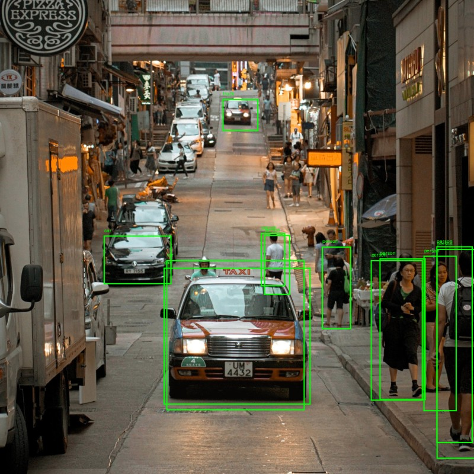

# Deep Learning Processing
A simple example on how to use deep learning (DL4J) together with processing.

#### Example Result

*detection took 2403 ms*

#### Credits
- Inspired by [holger-prause](https://github.com/holger-prause/dl4j_yolo)
- Photo by Xiang Ji on Unsplash
